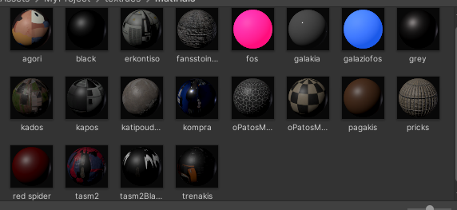
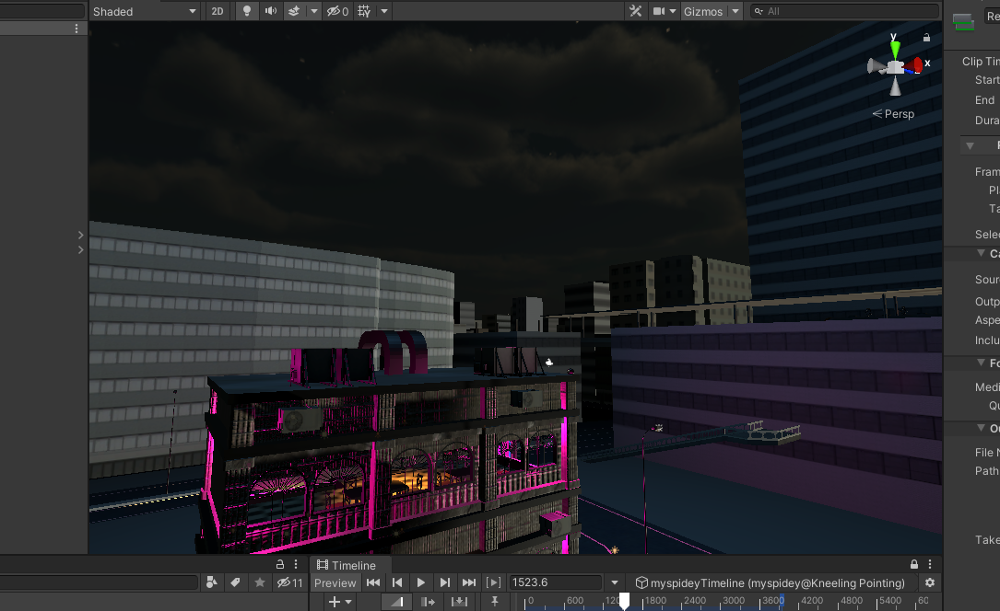
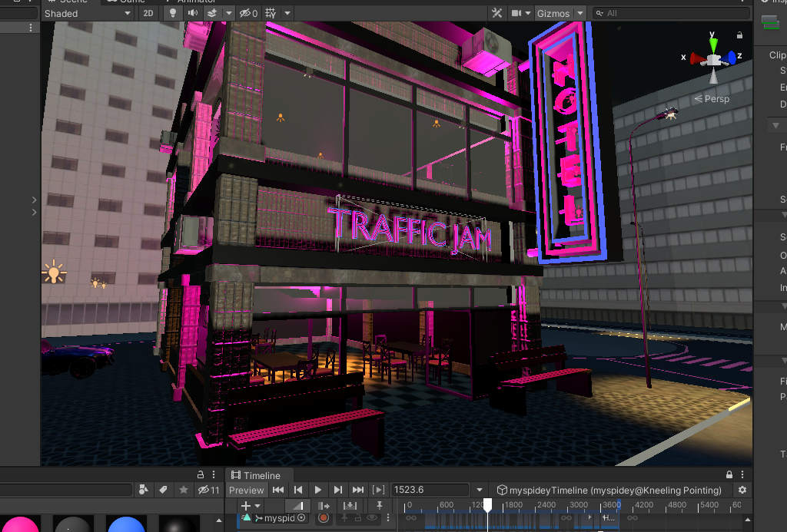

# Lesson: Digital Storytelling

### First and Last Name: Ανδρέας Μπιρμπίλης | Andreas Birmpilis
### University Registration Number: dpsd19080
### GitHub Personal Profile: [URL](https://github.com/dpsd19080)
### Digital-Storytelling-Individual-Assignment: [URL](https://github.com/dpsd19080/Digital-Storytelling-Individual-Assignment)

# Introduction
Στα πλαίσια του μαθήματος "Ψηφιακές μορφές αφήγησης" καλούμε να υλοποιήσω μια ατομική εργασία με θέμα την δημιουργία ενός animation (ελεύθερης θεματολογίας), η οποία αντιστοιχεί στο 50% του τελικού μου βαθμού.

# Summary
Η ατομική εργασία χωρίζεται σε τρία παραδοτέα: 
#### [1st Deliverable](https://github.com/dpsd19080/Digital-Storytelling-Individual-Assignment/blob/main/my_report/README.md#1st-deliverable-1):
#### [2st Deliverable](https://github.com/dpsd19080/Digital-Storytelling-Individual-Assignment/blob/main/my_report/README.md#2nd-deliverable):
#### [3st Deliverable](https://github.com/dpsd19080/Digital-Storytelling-Individual-Assignment/blob/main/my_report/README.md#3rd-deliverable):

# 1st Deliverable
Μου δόθηκε η επιλογή από τον δηδάσκοντα, είτε να ακολουθήσω επακριβώς τις οδηγίες των Units δημιουργώντας το επιθυμητό αποτέλεσμα με τα assets και τις προδιαγραφές τους για αρχή και έπειτα να κάνω την διαδηκασία ξανά με σκοπό την δημιουργία του δικού μου project (βασισμένο στα units) είτε να αρχίσω να υλοποιώ εξαρχής την δική μου ιδέα. Αποφάσισα λοιπόν να ξεκινήσω από τώρα το δικό μου project.

Αρχικά, με βάση τα Creative Challenges του Unit 2 πρέπει να έχω:
 - Τουλάχιστον 5 διαφορετικα κτήρια, σε διαφορετικά σχήματα 
 - Ένα background, middleground, και foreground 
 - Τουλάχιστον 5 διαφορετικα Materials
 - Διαφορετικό χρώμα και τοποθεσία του Directional Light 

Για την υλοποίηση των δύο πρώτων, χρησιμοποίησα μια έτοιμη πόλη που βρήκα στο Asset Store του Unity: [Japanese Otaku City](https://assetstore.unity.com/packages/3d/environments/urban/japanese-otaku-city-20359)

Έπειτα, όπως ζητάει έφτιαξα τα εξής materials:

Τέλος, άλλαξα το Directional Light με σκοπό να φαίνεται σαν να είναι βράδυ

[Τελικό αποτέλεσμα](https://github.com/dpsd19080/Digital-Storytelling-Individual-Assignment/blob/main/dailies/Deliverable1/Unit2/README.md)

Περνώντας στο Unit 3 και τα Creative Challenges του. Για να καλύψω τα γενικά ζητήματα του, χρησιμοποίησα αυτό το κτήριο: [Hotel building 3D Model](https://www.cgtrader.com/free-3d-models/architectural/architectural-street/hotel-building-3d-model-29fbeca1-4246-4448-85b8-8fae44c1551f) το οποίο επεξεργάστικα και του πρόσθεσα φωτά 

5 προπσ + 1 δικο μου

ανιμετιοσν ( χαρακτιρεσ, 

# 2nd Deliverable

# 3rd Deliverable 

# Conclusions

# Sources
