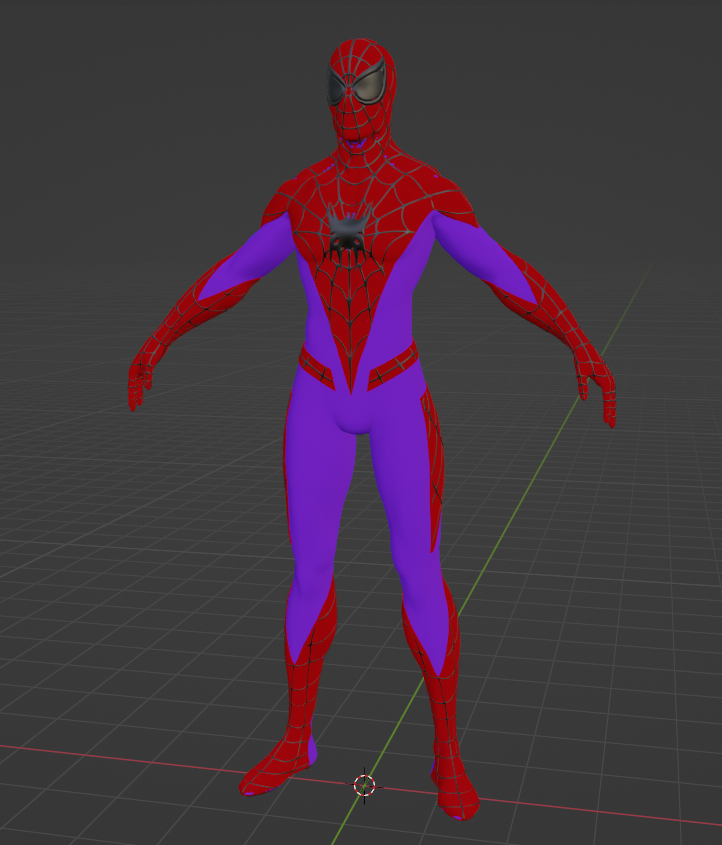

# Lesson: Digital Storytelling

### First and Last Name: Ανδρέας Μπιρμπίλης | Andreas Birmpilis
### University Registration Number: dpsd19080
### GitHub Personal Profile: [URL](https://github.com/dpsd19080)
### Digital-Storytelling-Individual-Assignment: [URL](https://github.com/dpsd19080/Digital-Storytelling-Individual-Assignment)

# Introduction
Στα πλαίσια του μαθήματος "Ψηφιακές μορφές αφήγησης" καλούμε να υλοποιήσω μια ατομική εργασία με θέμα την δημιουργία ενός animation (ελεύθερης θεματολογίας), η οποία αντιστοιχεί στο 50% του τελικού μου βαθμού.

# Summary
Η ατομική εργασία χωρίζεται σε τρία παραδοτέα: 
#### [1st Deliverable](https://github.com/dpsd19080/Digital-Storytelling-Individual-Assignment/blob/main/my_report/README.md#1st-deliverable-1):
#### [2st Deliverable](https://github.com/dpsd19080/Digital-Storytelling-Individual-Assignment/blob/main/my_report/README.md#2nd-deliverable):
#### [3st Deliverable](https://github.com/dpsd19080/Digital-Storytelling-Individual-Assignment/blob/main/my_report/README.md#3rd-deliverable):

# 1st Deliverable
Μου δόθηκε η επιλογή από τον δηδάσκοντα, είτε να ακολουθήσω επακριβώς τις οδηγίες των Units δημιουργώντας το επιθυμητό αποτέλεσμα με τα assets και τις προδιαγραφές τους για αρχή και έπειτα να κάνω την διαδηκασία ξανά με σκοπό την δημιουργία του δικού μου project (βασισμένο στα units) είτε να αρχίσω να υλοποιώ εξαρχής την δική μου ιδέα. Αποφάσισα λοιπόν να ξεκινήσω από τώρα το δικό μου project.

Αρχικά, με βάση τα [Creative Challenges](https://learn.unity.com/tutorial/unit-2-creative-challenge?uv=2019.4&courseId=5ee00851edbc2a0022274f75&projectId=5ed723a8edbc2a00202eb57e) του [Unit 2](https://learn.unity.com/project/unit-2-realtime-previsualization?uv=2019.4&courseId=5ee00851edbc2a0022274f75) πρέπει να έχω:
 - Τουλάχιστον 5 διαφορετικα κτήρια, σε διαφορετικά σχήματα 
 - Ένα background, middleground, και foreground 
 - Τουλάχιστον 5 διαφορετικα Materials
 - Διαφορετικό χρώμα και τοποθεσία του Directional Light 

Για την υλοποίηση των δύο πρώτων, χρησιμοποίησα μια έτοιμη πόλη που βρήκα στο Asset Store του Unity: [Japanese Otaku City](https://assetstore.unity.com/packages/3d/environments/urban/japanese-otaku-city-20359)

Έπειτα, όπως ζητάει έφτιαξα τα εξής materials:

Τέλος, άλλαξα το Directional Light έτσι ώστε να φαίνεται σαν να είναι βράδυ

[Τελικό αποτέλεσμα](https://github.com/dpsd19080/Digital-Storytelling-Individual-Assignment/blob/main/dailies/Deliverable1/Unit2/README.md)

Περνώντας στο [Unit 3](https://learn.unity.com/project/unit-3-environment-modeling-set-dressing-in-unity?uv=2019.4&courseId=5ee00851edbc2a0022274f75) και τα [Creative Challenges](https://learn.unity.com/tutorial/unit-3-creative-challenge?uv=2019.4&courseId=5ee00851edbc2a0022274f75&projectId=5ed981dbedbc2a03f97c0646) του. Για να καλύψω τα γενικά ζητήματα του, χρησιμοποίησα αυτό το κτήριο: [Hotel building 3D Model](https://www.cgtrader.com/free-3d-models/architectural/architectural-street/hotel-building-3d-model-29fbeca1-4246-4448-85b8-8fae44c1551f) το οποίο επεξεργάστικα και του πρόσθεσα φώτα 

Όσο για τα Creative Challenges έπρεπε να προσθέσω:
- 5 props (είτε αυτά που μου δίνονται στα assets των οδηγιών είτε κάποια που θα έβρισκα Online)
- 1 δικό μου που θα έφτιαχνα στο Pro Builder του Unity

Για το πρώτο, χρησιμοποίησα τρία απο αυτά που έρχονταν με το κτήριο που ανέφερα παραπάνω. Πιο συγκεκριμένα, τα παγκάκια, τις λάμπες και τις καρέκλες/τραπέζια μέσα) Τα υπόλοιπα τα βρήσα από το cgtrader και sketchfab αντίστοιχα: [Dumpster PBR Free low-poly 3D model](https://www.cgtrader.com/free-3d-models/exterior/street-exterior/dumpster-pbr-e593aea2-b340-4fdf-936e-7c6f92ba1e2b), [WIP: Shelby Cobra *Update June 06 2015](https://sketchfab.com/3d-models/wip-shelby-cobra-update-june-06-2015-f0ac3a16165e40e4aeaec9858d2c3785)

Τέλος, έλειπε μονάχα να φτιάξω το δικό μου prop. Επέλεξα (μιας και μου επιτράπηκε) να χρησιμοποιήσω το blender αντί για το Pro Builder, επειδή θεωρώ πως μπορώ να παράγω καλύτερο αποτέλεσμα μέσα απο αυτό.

Φαίνονται όλα τα props καλύτερα στο βίντεο [εδώ](https://github.com/dpsd19080/Digital-Storytelling-Individual-Assignment/tree/main/dailies/Deliverable1/Unit3)

Κάπου εδώ έπρεπε να ασχοληθώ με το αγαπημένο [Unit 4](https://learn.unity.com/project/unit-4-creating-an-animatic-a-preliminary-version-of-an-animation?uv=2019.4&courseId=5ee00851edbc2a0022274f75) που περίμενα από την αρχή! 

Τα [Creative Challenges](https://learn.unity.com/tutorial/unit-4-creative-challenge?uv=2019.4&courseId=5ee00851edbc2a0022274f75&projectId=5ed9b7cdedbc2a115bab2a9f#) εδώ είναι τα εξής:
- 1 Master Timeline
- Τουλάχιστον 1 Animated Χαρακτήρα 
- Τουλάχιστον 2 Animated Αντικείμενα 

Πρώτο challenge, αρκετά απλό. Δημιούργησα ένα Master Timeline κάνοντας δεξί κλικ > Create Empty και ονομάζοντας το "Master Timeline". Έχοντας ανοίξει το Timeline παράθυρο, έκανα drag and drop το Master Timeline και επέλεξα "Add Animation Track". Μετά απλός έβαζα εκεί τα animations μου και τα επεξεργαζόμουν καταλλήλως.

Στο δεύτερο challenge, χρησιμοποίησα τέσσερις χαρακτήρες: [Symbiotic Spider-Man (Andrew Garfield)](https://sketchfab.com/3d-models/symbiotic-spider-man-andrew-garfield-77c00d606ef54597be98d8d8142a9b7a), [Amazing Spider-Man 2 Movie](https://sketchfab.com/3d-models/amazing-spider-man-2-movie-bbdc7978e8554c97a66feffad5f7d33f), [Little Boy Rigged](https://www.cgtrader.com/free-3d-models/character/child/little-boy-rigged-animated-game-ready)

 #### Σημείωση: Το τέταρτο μοντέλο (Spider-Man) είναι μια συνεργασία του συμφητητή μου: [Μιχαήλ-Άγγελου Σωτήρχου](https://github.com/MichailAngelosSotirchos) με εμένα. Εκείνος δημιούργησε το μοντέλο και εγώ σχεδίασα την στολή.

Για την δημιουργία των animations χρησιμοποίησα το [Mixamo](https://www.mixamo.com/#/) το οποίο έλυσε τα προβλήματα, δημιουργίας πολλών aniamtions και σπατάλης χρόνου για αναζήτηση έτοιμων animations

 #### Σημείωση: Στο τελικό βίντεο του παραδοτέου για τα animations (βρίσκεται στο τέλος της αναφοράς του 1st Deliverable) φαίνετε μόνο ο [Symbiotic Spider-Man (Andrew Garfield)](https://sketchfab.com/3d-models/symbiotic-spider-man-andrew-garfield-77c00d606ef54597be98d8d8142a9b7a). Οι υπόλοιποι χαρακτήρες θα εμφανιστούν στο τελικό αποτέλεσμα!

Τέλος, έμενε μονάχα να κάνω animate δύο αντικείμενα. Κατέληξα σε αυτοκίνητα που υπήρχαν μέσα στα assets του [Japanese Otaku City](https://assetstore.unity.com/packages/3d/environments/urban/japanese-otaku-city-20359) 

και σε ένα τρένο που βρήκα στο cgtrader: [ELECTRIC TRAIN](https://www.cgtrader.com/free-3d-models/vehicle/train/electric-train-c73e99fe-d31f-4b67-9039-020a5ab348d7)

Τέλος, για να τα κάνω animate βασίστικα στο [Lesson 4.1 - Creating a Timeline and Adding Keyframed Animation Tracks](https://learn.unity.com/tutorial/lesson-4-1-creating-a-timeline-and-adding-keyframed-animation-tracks?uv=2019.4&courseId=5ee00851edbc2a0022274f75&projectId=5ed9b7cdedbc2a115bab2a9f#)
Δηλαδή, έκανα ξανά drag and drop τα αμάξια και το τρένο στο timeline, ξανά Add Animation Track, μόνο που αυτή την φορά πάτησα το rec και δούλεψα με Add keys.

[Τελικό αποτέλεσμα](https://github.com/dpsd19080/Digital-Storytelling-Individual-Assignment/tree/main/dailies/Deliverable1/Unit4) 

# 2nd Deliverable

Σε αυτό το παραδοτέο, με βάση τα [Creative Challenges](https://learn.unity.com/tutorial/unit-5-creative-challenge?uv=2019.4&courseId=5ee00851edbc2a0022274f75&projectId=5edae20fedbc2a0021a0cf31#) του [Unit 5](https://learn.unity.com/project/unit-5-create-compelling-shots-using-virtual-cameras?uv=2019.4&courseId=5ee00851edbc2a0022274f75) πρέπει να έχω:
 - Τουλάχιστον 3 Virtual Camera shots
 - Τουλάχιστον 1 blended shot ανάμεσα σε δύο Virtual Cameras

Για την υλοποίηση του πρώτου, βασιζόμενος στο tutorial του [Lesson 5.3 - Using Cinemachine to Create Multi-Camera Shots](https://learn.unity.com/tutorial/lesson-5-3-using-cinemachine-to-create-a-multi-camera-shot?uv=2019.4&courseId=5ee00851edbc2a0022274f75&projectId=5edae20fedbc2a0021a0cf31#) πρόσθεσα στην main camera το "CinemachineBrain" μέσω του Add Component 

Έπειτα, δημιούργισα ένα Cinemachine track στο timeline (σέρνοντας την main κάμερα εκεί). Πλέον μου έλειπε να δημιουργώ μια νέα Virtual Camera για κάθε διαφορετικό πλάνο που θέλω και να την κάνω animate όποτε χρειάζεται. 

Για το δεύτερο έπρεπε μονάχα να σύρω την μια κάμερα μέσα στην άλλη

[Τελικό αποτέλεσμα](https://github.com/dpsd19080/Digital-Storytelling-Individual-Assignment/tree/main/dailies/Deliverable2/Unit5)

# 3rd Deliverable 

# Conclusions

# Sources
#### 1st Deliverable:
- [Unit 2 - Real-time Previsualization](https://learn.unity.com/project/unit-2-realtime-previsualization?uv=2019.4&courseId=5ee00851edbc2a0022274f75)
- [Unit 3 - Environment, Modeling, and Set Dressing](https://learn.unity.com/project/unit-3-environment-modeling-set-dressing-in-unity?uv=2019.4&courseId=5ee00851edbc2a0022274f75)
- [Unit 4 - Animation](https://learn.unity.com/project/unit-4-creating-an-animatic-a-preliminary-version-of-an-animation?uv=2019.4&courseId=5ee00851edbc2a0022274f75)
- [Japanese Otaku City](https://assetstore.unity.com/packages/3d/environments/urban/japanese-otaku-city-20359)
- [Hotel building 3D Model](https://www.cgtrader.com/free-3d-models/architectural/architectural-street/hotel-building-3d-model-29fbeca1-4246-4448-85b8-8fae44c1551f)
- [Dumpster PBR Free low-poly 3D model](https://www.cgtrader.com/free-3d-models/exterior/street-exterior/dumpster-pbr-e593aea2-b340-4fdf-936e-7c6f92ba1e2b)
- [WIP: Shelby Cobra *Update June 06 2015](https://sketchfab.com/3d-models/wip-shelby-cobra-update-june-06-2015-f0ac3a16165e40e4aeaec9858d2c3785)
- [Symbiotic Spider-Man (Andrew Garfield)](https://sketchfab.com/3d-models/symbiotic-spider-man-andrew-garfield-77c00d606ef54597be98d8d8142a9b7a)
- [Amazing Spider-Man 2 Movie](https://sketchfab.com/3d-models/amazing-spider-man-2-movie-bbdc7978e8554c97a66feffad5f7d33f)
- [Little Boy Rigged](https://www.cgtrader.com/free-3d-models/character/child/little-boy-rigged-animated-game-ready)
- [Mixamo](https://www.mixamo.com/#/)
- [ELECTRIC TRAIN](https://www.cgtrader.com/free-3d-models/vehicle/train/electric-train-c73e99fe-d31f-4b67-9039-020a5ab348d7)
